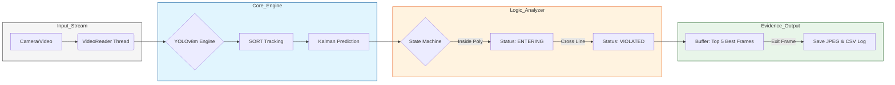

# SeantryBeacon: Hệ Thống Phát Hiện Vi Phạm Đi Sai Làn Đường

<div align="center">
  
  <br><br>
  
  [](#)
  [](#)
  [](#)
  
  **Giải pháp Thị giác Máy tính Tối ưu cho Giám sát Giao thông và Trích xuất Bằng chứng Hình ảnh Tự động.**
</div>

---

## Mục Lục
- [1. Phát biểu bài toán](#1-phát-biểu-bài-toán)
- [2. Công Nghệ sử dụng (Tech Stack Analysis)](#2công-nghệ-sử-dụng-tech-stack-analysis)
- [3. Kiến Trúc (Pipeline Architecture)](#3-kiến-trúc-pipeline-architecture)
- [4. Các Điểm Sáng Kỹ Thuật (Strategic Advantages)](#4-các-điểm-sáng-kỹ-thuật-strategic-advantages)
- [5. Demo Thực Nghiệm (Evidence Case Studies)](#5-demo-thực-nghiệm-evidence-case-studies)
- [6. Cấu Trúc](#6-cấu-trúc)

---

## 1. Phát biểu bài toán
Trong bối cảnh hạ tầng giao thông đô thị ngày càng phức tạp, việc kiểm soát các làn đường trở thành thách thức lớn. **SeantryBeacon** ra đời để giải quyết bài toán này bằng sự kết hợp giữa Deep Learning và Logic toán học chính xác.

> [!NOTE]
> Hệ thống không chỉ đơn thuần là một bộ lọc vật thể; nó là một **Cỗ máy Quyết định** dựa trên trạng thái (State-based) giúp loại bỏ mọi sai số ngẫu nhiên từ camera nhiễu.

**Mục tiêu:**
- **Tốc độ**: Phát hiện lấn làn với độ trễ gần như bằng không.
- **Chính xác**: Chụp và lưu trữ hình ảnh hiện trường cùng ID định danh duy nhất.
- **Độ tin cậy**: Sử dụng Kalman Filter để "nhìn xuyên" qua các khoảnh khắc mất dấu tạm thời.

---

##  2. Công Nghệ sử dụng (Tech Stack Analysis)

Chúng em lựa chọn những công nghệ tối ưu nhất để đảm bảo sự cân bằng giữa **Độ chính xác** và **Tốc độ xử lý**.

| Thành Phần | Công Nghệ Lõi | Phân Tích Kỹ Thuật |
| :--- | :--- | :--- |
| **Detection** | `YOLOv8m` | Model trung bình của Ultralytics giúp nhận diện tốt cả vật thể xa, nhỏ nhưng vẫn duy trì >25 FPS. |
| **Tracking** | `SORT Framework` | Kết hợp Kalman Filter và Hungarian Algorithm để bám đuổi ID xe qua hàng ngàn Frame. |
| **Region Logic** | `Ray-Casting` | Giải thuật toán học kiểm tra điểm nằm trong đa giác cấm với độ phức tạp $O(N)$ cực thấp. |
| **Storage** | `OpenCV FFmpeg` | Tối ưu hóa việc nén ảnh và ghi dữ liệu đa luồng không gây đứng queue xử lý. |

> **NOTE**
> Chúng em chọn phiên bản `m` (medium) thay vì `n` (nano) để bắt được chi tiết các loại xe ở khoảng cách 50m-100m, nơi mà các model nhỏ hơn thường bị nhầm lẫn giữa bóng xe và vật thể thực.

---

## 3. Kiến Trúc (Pipeline Architecture)

Hệ thống được thiết kế theo tư duy **Asynchronous Processing** (Xử lý bất đồng bộ) để tối đa hóa hiệu suất phần cứng và đảm bảo không bị mất khung hình (Frame-drop).

### Chi tiết các Giai đoạn Xử lý:

| Giai Đoạn (Stage) | Thành Phần (Component) | Chi Tiết Xử Lý (Processing Detail) | Kết Quả Đầu Ra (Output) |
| :--- | :--- | :--- | :--- |
| **1. Đón Nhận Dữ Liệu** | `VideoReader` | Đọc luồng video hoặc camera đa luồng (multi-threading). | Hàng đợi các Frame hình ảnh (Queue). |
| **2. Phân Tích Thực Thể** | `YOLOv8m Engine` | Phát hiện vật thể và phân loại (Ô tô, Xe máy, Xe buýt). | Tọa độ Bounding Box (xyxy) & Confidence. |
| **3. Theo Dõi Chuyển Động** | `SORT & Kalman` | Gắn ID duy nhất và dự báo vị trí thực thể bị che khuất. | Quỹ đạo chuyển động (Trajectory) từng ID. |
| **4. Kiểm Chứng Logic** | `State Machine` | Đối soát tọa độ với Polygon (vùng cấm) và Line (vạch vi phạm). | Trạng thái phương tiện (TRACKING/VIOLATED). |
| **5. Kết Xuất Bằng Chứng** | `ViolationSaver` | Chắt lọc 5 khung hình tốt nhất từ bộ đệm chuyển động. | Ảnh Scene/Crop rõ nét & Nhật ký CSV. |

### Sơ đồ Luồng Công Việc (Work-flow Diagram):



> [!IMPORTANT]
> **State Machine Logic:** 
> Hệ thống chỉ kích hoạt vi phạm khi đối tượng thỏa mãn đồng thời: (1) Nằm trong vùng đa giác cấm và (2) Có quỹ đạo cắt ngang vạch vi phạm (Violation Line). Điều này loại bỏ hoàn toàn các trường hợp xe đỗ sát vạch nhưng không vi phạm.

---

## 4. Các Tính Năng Đặc Biệt (Key Features)

### a. Theo dõi Đa Đối Tượng Hiệu Quả
Sử dụng Kalman Filter để "dự đoán" vị trí xe, giúp hệ thống không bị mất dấu ngay cả khi các xe đi sát nhau hoặc che lấp nhau một phần.

### b. Cơ chế Lưu Trữ Thông Minh (Evidence Selection)
Thay vì lưu ảnh ngay lúc vừa chạm vạch, hệ thống sẽ liên tục theo dõi cho đến khi xe rời đi để chọn ra những khung hình có kích thước và độ rõ nét tốt nhất (Top 5 Best Frames) làm bằng chứng.

### c. Xử Lý Hiện Trường Trực Quan
Mỗi trường hợp vi phạm sẽ được xuất ra kèm theo ảnh toàn cảnh (Scene) có đánh dấu vị trí xe, ID và thời điểm vi phạm.

---

## 5. Demo Thực Nghiệm (Evidence Case Studies)

Kết quả vận hành thực tế cho thấy sự chính xác và trích xuất đặc điểm.

### Phương Tiện ID 5 (Xe Sedan Trắng)
- **Tình huống**: Phương tiện di chuyển từ làn rẽ trái nhưng vẫn tiếp tục đi thẳng.
- **Dữ liệu ghi nhận**: Hệ thống quan sát tốt cho việc xác định loại xe và theo dõi.

<div align="center">
  
  <br>
  <i>Ảnh 5.1: Ghi nhận vi phạm tại làn đường.</i>
  <br><br>
  
  <br>
  <i>Ảnh 5.2: Đặc điểm phương tiện được lưu trữ rõ nét dưới điều kiện ánh sáng mạnh.</i>
</div>

---
### Phương Tiện ID 6 (Xe Sedan Đen)
- **Tình huống**: Phương tiện từ làn rẽ trái gần đến đoạn giao lập tức chuyển làn và đi thẳng.
- **Dữ liệu ghi nhận**: Dù đối tượng tránh né, Kalman Filter vẫn duy trì theo dõi bám đuổi ID ổn định.

<div align="center">
  
  <br>
  <i>Ảnh 5.3: Hiện trường vi phạm với nhãn ID và trạng thái VIOLATED.</i>
  <br><br>
  
  <br>
  <i>Ảnh 5.4: Khung hình "Best Frame" trích xuất từ bộ đệm chuyển động.</i>
</div>

---

## 6. Cấu Trúc

Hệ thống tự động hóa hoàn toàn việc phân loại dữ liệu để phục vụ công tác tra cứu nhanh.

**Cấu trúc lưu trữ:**
```text
evidence_lane/run_TIMESTAMP/
├── violations.csv                     # Nhật ký vi phạm tổng hợp
├── vp_0001_id5_..._scene.jpg          # Ảnh toàn cảnh vi phạm
├── vp_0001_id5_..._crop.jpg           # Ảnh cắt xe tại thời điểm cắt vạch
└── vp_0001_id5_..._best.jpg           # Ảnh đặc điểm xe rõ nét nhất
```

**Dữ liệu nhật ký mẫu (CSV):**
| # | Track ID | Frame | Time (s) | Base Filename |
| :--- | :--- | :--- | :--- | :--- |
| 1 | 5 | 88 | 2.93 | `vp_0001_id5_20260416_233757_006` |
| 2 | 6 | 120 | 4.00 | `vp_0002_id6_20260416_233801_457` |

---
<div align="center">

*Chúng tôi tin rằng công nghệ có thể làm cho con đường về nhà của mỗi người trở nên an toàn hơn.*  
*Hãy giữ vững tay lái và tuân thủ luật lệ giao thông.* 

<br/>

© 2026 **SentryBeacon Team** · Developed by [Nguyen Duc Manh](https://github.com/ducmanh-jr)

</div>
