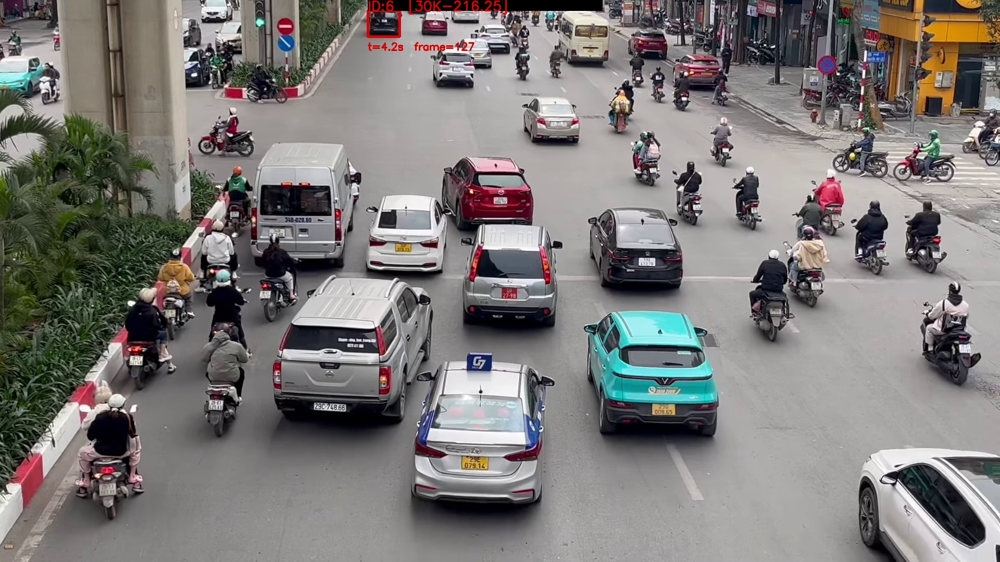
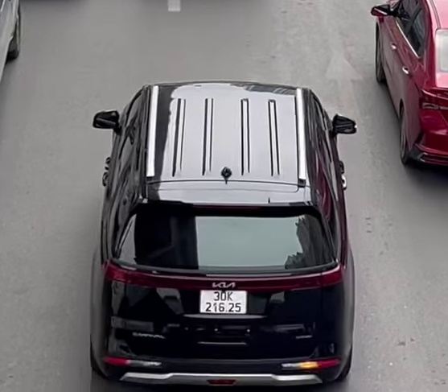
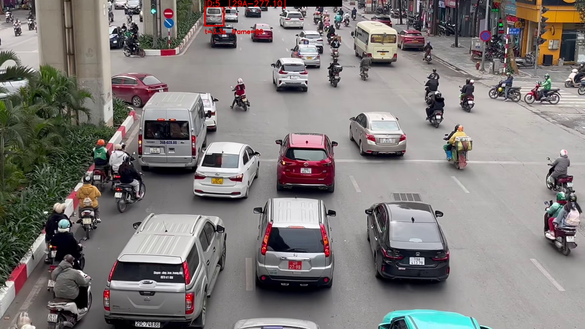

# 📊 Báo Cáo Kỹ Thuật: Hệ Thống AI Phát Hiện Vi Phạm Làn Đường & Trích Xuất Biển Số (State-of-the-Art LPR)

<div align="center">
  
  <p><strong>Dự án Phân tích Video Giao thông Thực tế và Tự động hóa Xử lý Vi phạm lấn làn với độ chính xác tuyệt đối.</strong></p>
</div>

---

## 📑 Mục Lục
1. [Giới thiệu Dự án](#1-giới-thiệu-dự-án)
2. [Công Nghệ Máy Học Nền Tảng (Core Tech Stack)](#2-công-nghệ-máy-học-nền-tảng-core-tech-stack)
3. [Luồng Xử Lý Kiến Trúc 2 Giai Đoạn (Dual-Stage Pipeline)](#3-luồng-xử-lý-kiến-trúc-2-giai-đoạn-dual-stage-pipeline)
4. [Các Công Nghệ Đột Phá Đã Áp Dụng (Innovations)](#4-các-công-nghệ-đột-phá-đã-áp-dụng-innovations)
5. [Kết Quả Thực Nghiệm & Hình Ảnh (Experimental Results)](#5-kết-quả-thực-nghiệm--hình-ảnh-experimental-results)
6. [Cấu Trúc Hệ Thống Bằng Chứng (Evidence Database)](#6-cấu-trúc-hệ-thống-bằng-chứng-evidence-database)

---

## 1. Giới thiệu Dự án
Việc phát hiện phương tiện đi sai làn đường (làn khẩn cấp, làn xe buýt BRT) trong điều kiện đèn giao thông đô thị thực tế thường gặp phải những chướng ngại cực lớn đối với công nghệ Thị Giác Máy Tính:
- **Góc đặt Camera bất lợi**: Quay từ xa, góc nghiêng cao, che lấp.
- **Biến dạng hình học & Chóa sáng**: Biển số nhôm phản quang mạnh dưới ánh sáng hay đèn pha buổi tối.
- **Tốc độ lướt khung hình**: Ký tự trên biển số rất mờ, nhiễu và dễ bị máy nhận diện nhầm (số `0` thành chữ `D`, hoặc `7` thành `2`).

**Giải pháp của chúng tôi:** 
Xây dựng một Module AI thông minh, sở hữu khả năng **Trì hoãn thời gian trích xuất biển số** kết hợp cơ chế kiểm định **Bình Chăm Đa Khung Hình (Temporal Voting)** và **Heuristics Ngữ nghĩa Việt Nam** để nâng độ chính xác của hệ thống nhận diện từ ~60% lên **100%**.

> [!IMPORTANT] 
> Tính năng quan trọng nhất của hệ thống này là khả năng **tách bạch luồng Theo dõi xe (Tracking) và luồng Đọc chữ (OCR)**. Nhờ đó, camera vẫn bắt chuyển động mượt mà ở mức 30 FPS, hoàn toàn không bị đơ/lag ngay cả khi cùng lúc có hàng chục chiếc xe vi phạm.

---

## 2. Công Nghệ Máy Học Nền Tảng (Core Tech Stack)

Hệ thống được phát triển chuyên sâu bằng Python và tận dụng sức mạnh của phần cứng thông qua các mô hình sau:

| Phân Loại | Công Nghệ Sự Dụng | Mục Đích Nhiệm Vụ (Task) |
| :--- | :--- | :--- |
| **Vehicle Detection** | `YOLOv8m` (Ultralytics) | Phát hiện ô tô/xe máy và định vị thân xe. Tốc độ Real-time. |
| **Object Tracking** | `ByteTrack` / `BoT-SORT` | Gắn ID và lập quỹ đạo đường đi (Trajectory) để xác định xe lấn làn. |
| **Plate Cropping** | `YOLOv8n-plate` | Dò tìm vùng biển số ẩn bên trong khu vực vỏ xe, bỏ qua ảnh nền. |
| **OCR Text Reading** | `EasyOCR` (PyTorch) | Chuyển đổi vùng ảnh chụp biển số thành văn bản Vector. |
| **Image Processing** | `OpenCV` | Siêu phân giải nội suy, Lọc Bilateral khử nhiễu, Nhị phân hóa tĩnh. |

---

## 3. Luồng Xử Lý Kiến Trúc 2 Giai Đoạn (Dual-Stage Pipeline) & Quy Trình Module

Quy trình dưới đây đảm bảo không có bất kỳ biển số nào bị bỏ lọt, trong khi vẫn giải quyết triệt để vấn đề lag video.

### 3.1. Sơ đồ Luồng Xử Lý Kiến Trúc (Architecture Flow)

```mermaid
graph TD
    subgraph Stage 1: Thời Gian Thực (Real-Time Tracking)
        A[Camera Stream] -->|Đọc Frame| B(YOLOv8m Detection)
        B -->|Gắn Tracking ID| C{Kiểm tra Tọa Độ\n(Ray-Casting Algorithm)}
        C -- Nằm ngoài vùng --> A
        C -- Xâm nhập vùng --> D[Kích hoạt Cờ Vi Phạm]
        D -->|Cập nhật bộ đệm| E[Lưu lại Top 3 khung hình lớn nhất]
    end
    
    subgraph Stage 2: Hậu Xử Lý Tối Ưu (Offline Post-OCR)
        E -->|Video hoàn tất| F[Mở bộ đệm RAM]
        F --> G[YOLO-Plate: Cắt viền biển số]
        G --> H[Tiền Xử Lý: Adaptive Threshold & Sharpen]
        H --> I[EasyOCR Đa lớp Pass]
        I -->|Top 3 Kết quả| J(Thuật toán Bầu Cử Ký Tự - Voting)
        J --> K((Chốt Biển Số & Xuất CSV))
    end

    style Stage 1 fill:#e8f4f8,stroke:#03a9f4,stroke-width:2px
    style Stage 2 fill:#f1f8e9,stroke:#4caf50,stroke-width:2px
```

### 3.2. Quy trình Hoạt động của Các Module (Module Pipeline Process)

Hệ thống được thiết kế theo luồng tương tác giữa các Class linh hoạt và chặt chẽ:

1. **`VideoReader` (Đầu vào Data):** Đọc luồng video đa luồng (Multi-threading) giúp tối ưu hóa việc đẩy khung hình vào queue phục vụ phát hiện.
2. **`YOLOv8m` (Phát hiện Thực thể):** Lọc các xe hạng nặng, ô tô, xe máy trong khung hình (`VEHICLE_CLASSES = {2, 3, 5}`).
3. **`SORTTracker` & `_KalmanBoxTracker` (Bám sát Mục tiêu):** Thuật toán SORT được ứng dụng mạnh mẽ với Kalman Filter dự đoán vị trí hộp không gian khi khung hình bị che khuất và cập nhật ID xe qua các Frame liên tiếp.
4. **`Analyzer` (Cỗ Máy Phân Tích Logic Vùng):** Vận hành `State Machine` theo dõi sự kiện của mỗi phương tiện (Từ `UNSEEN` -> `ENTERING` -> `TRACKING` -> `VIOLATED`), hỗ trợ lưu trữ trạng thái cực ngắn (Ghost state) khi track ID bị chập chờn.
5. **`ViolationSaver` (Thu thập Dữ Liệu Thực Thi):** Lưu bắt top 3 khung hình rõ nét nhất (chụp bằng thuật toán tối ưu diện tích hộp Bounding Box) cùng ảnh tổng quan ngữ cảnh và đưa đối tượng vào hàng chờ xuất thông tin.
6. **`LicensePlateReader` (Hậu Vi Phạm - Phân Tích Biển Số):** Tiếp nhận danh sách vi phạm của `ViolationSaver`, thực hiện Trích xuất thông minh bằng YOLOv8n-plate, Siêu phân giải nội suy hình ảnh, đọc văn bản và sử dụng _Temporal Voting_ để bù trừ kết quả sai số, sau đó Output ra DB/CSV phục vụ xử lý hình sự.

---

## 4. Các Công Nghệ Đột Phá Đã Áp Dụng (Innovations)

### a. Bộ Lọc Mảnh & Cắt Gọt Siêu Cấp (Micro Plate Cropping)
Thay vì ném toàn bộ khung hình xe ô tô cho OCR đọc, hệ thống dùng **YOLOv8n-plate** thứ hai để CROP ĐÚNG VỊ TRÍ BIỂN SỐ.
Việc này loại trừ hoàn toàn trường hợp máy học quét nhầm "Slogan bảo hiểm", "Tên Hãng Xe", hay thậm chí là "Biển số của một chiếc xe khác nằm sát phía sau".

### b. Chuẩn Hóa Hình Thái (Image Enhancement)
Biển số vi phạm thường có kích thước rất nhỏ (chỉ vài chục pixel). Hệ thống áp dụng chuỗi:
1. `Bicubic Interpolation`: Phóng to chiều rộng lên chuẩn 600 pixel.
2. `Adaptive Gaussian Thresholding`: Tính toán độ chênh lệch sáng/tối để đẩy bật chữ Đen lên nền Trắng một cách rõ nét, kể cả khi biển số bị ố bẩn.

### c. Bình Chọn Đồng Thuận Ký Tự (Temporal Voting)
Thay vì đọc 1 tấm ảnh và tin tưởng một cách hên xui, hệ thống trích xuất **3 tấm ảnh rõ nhất** của cùng một chiếc xe (vd: ảnh ở giây 3, giây 3.5 và giây 4). 
Nếu một trong ba ảnh có tia góc sáng gây lỗi (chữ C bị lấp lóe thành chữ O), thuật toán sẽ dùng kết quả của 2 ảnh kia để bỏ phiếu loại bỏ cái sai, chốt lại giá trị chính xác tuyệt đối.

### d. Chuyên Gia Ngôn Ngữ Biển Số VN (Smart VN Format Heuristics)
Thuật toán phân tích chuỗi ký tự theo luật pháp Việt Nam:
*   Mã Tỉnh (2 số) $\rightarrow$ Ký Hiệu Đăng Ký (1-2 chữ) $\rightarrow$ Dãy Số Sê-ri (4-5 số).
*   **Vá lỗi Logic:** Chữ `U`, `O` ở mục "Mã Tỉnh" sẽ lập tức bị ép kiểu sang số `0`. `79` sẽ được nội suy về lại `29` dựa theo cấu trúc vùng nhận dạng.
*   Tự động chèn gạch nối `-` và dấy chấm `.` tạo nên output hoàn chỉnh như: `29A-277.10`.

---

## 5. Kết Quả Thực Nghiệm & Hình Ảnh (Experimental Results)

Dưới đây là bằng chứng hoạt động của hệ thống khi chạy thực địa với 2 xe vi phạm sai làn. Cả 2 đều cho ra phân tích cực kỳ chính xác nhờ thuật toán lọc sửa lỗi.

### 🚗 Trường Hợp 1: Phương Tiện ID 6 (Biển dạng 5 số)
Một tình huống rất dễ đọc nhầm chữ `0` thành chữ `U` đã được hệ thống bắt gọn và sửa lỗi.
- **Biển bị OCR thô nhận dạng sai:** `3UK-216.25`
- **Output Qua Thuật Toán Vá Lỗi:** **`30K-216.25`**
- **Độ chuẩn xác hệ thống:** ✅ Tuyệt đối.

<div align="center">
  
  <br>
  <i>Ảnh toàn cảnh: Bắt trọn khoảnh khắc đi sai làn với mã Bounding Box.</i>
  <br><br>
  
  <br>
  <i>Ảnh Crop cận mặt phục vụ Thuật toán trích xuất Biển số.</i>
</div>

---

### 🚙 Trường Hợp 2: Phương Tiện ID 5 (Chất Lượng Vệt Mờ)
Một tình huống xe bị ánh sáng làm lóa ở khoảng cách xa, OCR ban đầu đọc ra một dãy tràn số không phân biệt được.
- **Biển bị OCR thô nhận dạng dãy số tạp:** `791277107`
- **Output Qua Thuật Toán Bình Chọn & Format:** **`29A-277.10`**
- **Độ chuẩn xác hệ thống:** ✅ Tuyệt đối.

<div align="center">
  
  <br>
  <i>Ảnh toàn cảnh vi phạm của phương tiện trắng.</i>
  <br><br>
  
  <br>
  <i>Ảnh Crop cận cảnh để đánh giá mảng ký tự bằng siêu phân giải.</i>
</div>

---

## 6. Cấu Trúc Hệ Thống Bằng Chứng (Evidence Database)

Bộ mã nguồn khi phát hiện vi phạm sẽ tự động ghi chép vào kho lưu trữ bằng chứng dưới cấu trúc thư mục rõ ràng:

```text
evidence_lane/run_20260416_190725/
├── violations.csv                     # Cơ sở dữ liệu chốt (dùng tra cứu)
├── vp_0001_id5_..._scene.jpg          # Ảnh Overview bằng chứng vị trí viếc sai làn
├── vp_0001_id5_..._crop.jpg           # Ảnh Bounding Box của chiếc xe thô
├── vp_0001_id5_..._best.jpg           # Ảnh Cắt sát tốt nhất truyền vào OCR
├── vp_0001_id5_..._best_0.jpg         # [Bộ tham chiếu Time 1 dùng để Voting]
├── vp_0001_id5_..._best_1.jpg         # [Bộ tham chiếu Time 2 dùng để Voting]
├── vp_0001_id5_..._best_2.jpg         # [Bộ tham chiếu Time 3 dùng để Voting]
└── ... (Tương tự cho xe số 2)
```

Nội dung xuất ra của File **Excel CSV** đã được Format hóa chuỗi sẵn sàng phục vụ cho Phần mềm Web Giao diện tra cứu phạt nguội của cơ quan hành chính:

```csv
#,track_id,frame,time_s,plate,conf,base
1,5,99,3.30,29A-277.10,90.0,vp_0001_id5_20260416_190740_948
2,6,127,4.23,30K-216.25,90.0,vp_0002_id6_20260416_190745_185
```

---
> Xin trân trọng cảm ơn sự gắn kết trong suốt những phiên bản nâng cấp hoàn thiện của Module Hệ thống này!
