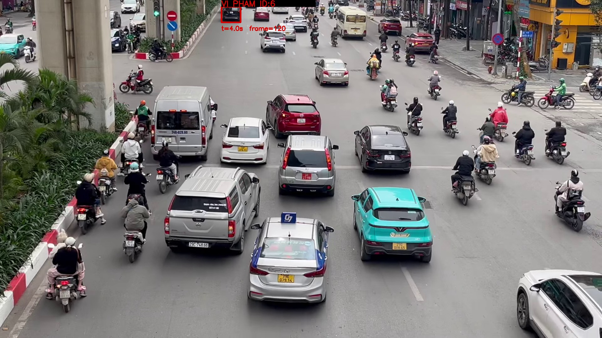
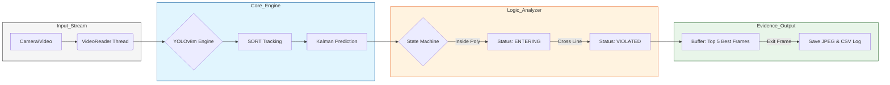
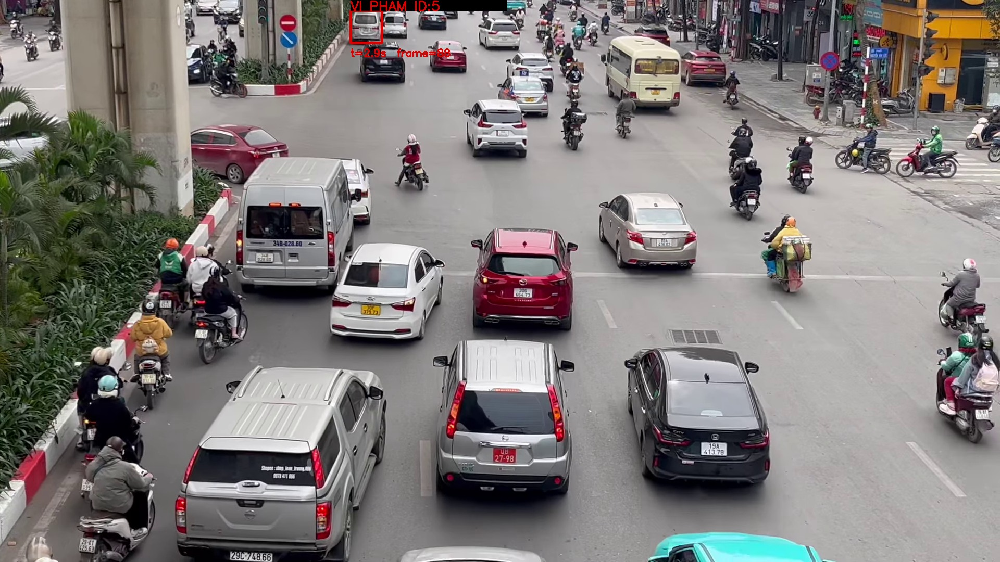
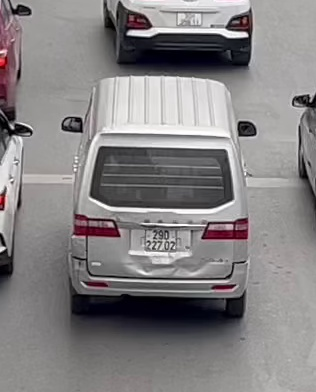
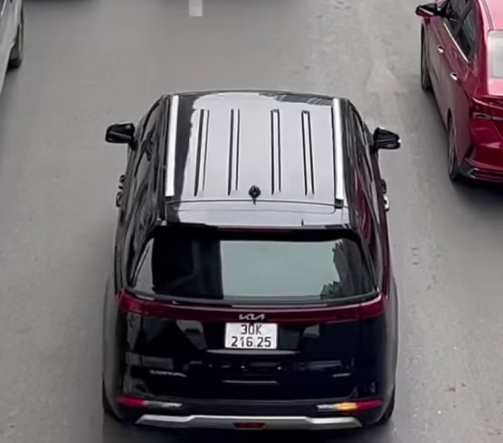

# SeantryBeacon: Hệ Thống Phát Hiện Vi Phạm Đi Sai Làn Đường

<div align="center">
  
  <br><br>

  
  **Giải pháp Thị giác Máy tính Tối ưu cho Giám sát Giao thông và Trích xuất Bằng chứng Hình ảnh Tự động.**
</div>

---

## Mục Lục
- [1. Phát biểu bài toán](#1-phát-biểu-bài-toán)
- [2. Công Nghệ sử dụng (Tech Stack Analysis)](#2công-nghệ-sử-dụng-tech-stack-analysis)
- [3. Kiến Trúc (Pipeline Architecture)](#3-kiến-trúc-pipeline-architecture)
- [4. Quy trình hoạt động thực tế ](#4-quy-trinh-hoạt-động-thực-tế)
- [5. Các Tính Năng Đặc Biệt (Key Features)](#5-tính-năng-đặc-biệt)
- [6. Demo Thực Nghiệm (Evidence Case Studies)](#5-demo-thực-nghiệm-evidence-case-studies)
- [7. Cấu Trúc](#6-cấu-trúc)

---

## 1. Phát biểu bài toán
Trong bối cảnh hạ tầng giao thông đô thị ngày càng phức tạp, việc kiểm soát các làn đường trở thành thách thức lớn. **SeantryBeacon** ra đời để giải quyết bài toán này bằng sự kết hợp giữa Deep Learning và Logic toán học chính xác.

> [!NOTE]
> Hệ thống không chỉ đơn thuần là một bộ lọc vật thể; nó là một **Cỗ máy Quyết định** dựa trên trạng thái (State-based) giúp loại bỏ mọi sai số ngẫu nhiên từ camera nhiễu.

**Mục tiêu:**
- **Tốc độ**: Phát hiện lấn làn với độ trễ gần như bằng không.
- **Chính xác**: Chụp và lưu trữ hình ảnh hiện trường cùng ID định danh duy nhất.
- **Độ tin cậy**: Sử dụng Kalman Filter để "nhìn xuyên" qua các khoảnh khắc mất dấu tạm thời.

### Thông số kỹ thuật (Technical Specifications)
Hệ thống được tối ưu hóa để đảm bảo độ chính xác trong nhận diện và duy trì hiệu suất xử lý thời gian thực.

| Thành phần | Công nghệ / Giá trị |
| :--- | :--- |
| **Mô hình AI** | **YOLOv8m (Medium)** — Cân bằng tối ưu giữa độ chính xác và tốc độ xử lý. |
| **Thuật toán theo vết** | **SORT** (Kalman Filter & Hungarian Algorithm) giúp duy trì ID thực thể liên tục. |
| **Xử lý luồng** | **Multi-threading** với lớp `VideoReader` riêng biệt, giảm thiểu độ trễ đọc khung hình. |
| **Đối tượng nhận diện** | Ô tô (Car), Xe máy (Moto), Xe buýt (Bus). |
| **Dữ liệu đầu ra** | Ảnh hiện trường (Scene), Ảnh cận cảnh (Crop), Nhật ký vi phạm (CSV). |

##  2. Công Nghệ sử dụng (Tech Stack Analysis)
Chúng em lựa chọn những công nghệ tối ưu nhất để đảm bảo sự cân bằng giữa **Độ chính xác** và **Tốc độ xử lý**.

| Thành Phần | Công Nghệ Lõi | Phân Tích Kỹ Thuật |
| :--- | :--- | :--- |
| **Detection** | `YOLOv8m` | Model trung bình của Ultralytics giúp nhận diện tốt cả vật thể xa, nhỏ nhưng vẫn duy trì >25 FPS. |
| **Tracking** | `SORT Framework` | Kết hợp Kalman Filter và Hungarian Algorithm để bám đuổi ID xe qua hàng ngàn Frame. |
| **Region Logic** | `Ray-Casting` | Giải thuật toán học kiểm tra điểm nằm trong đa giác cấm với độ phức tạp $O(N)$ cực thấp. |
| **Storage** | `OpenCV FFmpeg` | Tối ưu hóa việc nén ảnh và ghi dữ liệu đa luồng không gây đứng queue xử lý. |

> **NOTE**
> Chúng em chọn phiên bản `m` (medium) thay vì `n` (nano) để bắt được chi tiết các loại xe ở khoảng cách 50m-100m, nơi mà các model nhỏ hơn thường bị nhầm lẫn giữa bóng xe và vật thể thực.

---

## 3. Kiến Trúc (Pipeline Architecture)

Hệ thống được thiết kế theo tư duy **Asynchronous Processing** (Xử lý bất đồng bộ) để tối đa hóa hiệu suất phần cứng và đảm bảo không bị mất khung hình (Frame-drop).

### Chi tiết các Giai đoạn Xử lý:

| Giai Đoạn (Stage) | Thành Phần (Component) | Chi Tiết Xử Lý (Processing Detail) | Kết Quả Đầu Ra (Output) |
| :--- | :--- | :--- | :--- |
| **1. Đón Nhận Dữ Liệu** | `VideoReader` | Đọc luồng video hoặc camera đa luồng (multi-threading). | Hàng đợi các Frame hình ảnh (Queue). |
| **2. Phân Tích Thực Thể** | `YOLOv8m Engine` | Phát hiện vật thể và phân loại (Ô tô, Xe máy, Xe buýt). | Tọa độ Bounding Box (xyxy) & Confidence. |
| **3. Theo Dõi Chuyển Động** | `SORT & Kalman` | Gắn ID duy nhất và dự báo vị trí thực thể bị che khuất. | Quỹ đạo chuyển động (Trajectory) từng ID. |
| **4. Kiểm Chứng Logic** | `State Machine` | Đối soát tọa độ với Polygon (vùng cấm) và Line (vạch vi phạm). | Trạng thái phương tiện (TRACKING/VIOLATED). |
| **5. Kết Xuất Bằng Chứng** | `ViolationSaver` | Chắt lọc 5 khung hình tốt nhất từ bộ đệm chuyển động. | Ảnh Scene/Crop rõ nét & Nhật ký CSV. |

### Sơ đồ Luồng Công Việc (Work-flow Diagram):



> [!IMPORTANT]
> **State Machine Logic:** 
> Hệ thống chỉ kích hoạt vi phạm khi đối tượng thỏa mãn đồng thời: 
    (1) Nằm trong vùng cấm
    (2) Có quỹ đạo cắt ngang vạch vi phạm (Violation Line). 
  Điều này loại bỏ hoàn toàn các trường hợp xe đỗ sát vạch nhưng không vi phạm.

---
## 4. Quy trình hoạt động thực tế

Hệ thống vận hành dựa trên sự kết hợp giữa thị giác máy tính (Computer Vision) và các thuật toán hình học để xác định hành vi vi phạm một cách chính xác nhất.

---
### 1. Nhận diện và Khởi tạo Theo vết (Detection & Initialization)
* **Phát hiện:** Khi xe xuất hiện, mô hình **YOLOv8m** thực hiện quét và phân loại phương tiện (**Ô tô, Xe máy, Xe buýt**).
* **Định danh:** Thuật toán **SORT** ngay lập tức cấp một **ID duy nhất** (Ví dụ: `ID: 05`) để theo dõi riêng biệt.
* **Dự đoán:** Bộ lọc **Kalman Filter** được sử dụng để dự đoán vị trí tiếp theo, duy trì ID ổn định ngay cả khi xe bị che khuất tạm thời (occlusion).

### 2. Trạng thái Đi vào Vùng cấm (Entering Zone)
Khi xe di chuyển vào khu vực đa giác (`ZONE_POLYGON`) đã thiết lập:
* **Chuyển trạng thái:** Hệ thống đặt ID vào trạng thái `S_ENTERING`.
* **Xác nhận hành vi:** Xe phải duy trì trong vùng này tối thiểu một số lượng khung hình nhất định (`ENTER_CONFIRM_FRAMES`) để loại bỏ các trường hợp nhận diện sai hoặc nhiễu kỹ thuật.

### 3. Trạng thái Theo dõi (Tracking)
Sau khi xác nhận, xe chuyển sang trạng thái `S_TRACKING`:
* **Thu thập dữ liệu:** Liên tục ghi lại tọa độ điểm đáy (bottom center) và diện tích khung bao (Bbox).
* **Chọn lọc bằng chứng:** Hệ thống tự động phân tích và lưu các khung hình xe có độ nét cao, kích thước lớn vào danh sách `best_frames`.

### 4. Kích hoạt Vi phạm (Violation Trigger)
Vi phạm chính thức được xác lập dựa trên thuật toán hình học khi hội đủ hai điều kiện:
1.  Xe đang ở trạng thái `S_TRACKING` bên trong làn cấm.
2.  **Cắt vạch vi phạm:** Kiểm tra đoạn thẳng nối từ vị trí $(t-1)$ đến vị trí $(t)$ có giao cắt với đường giới hạn vi phạm (`VLINE_A` → `VLINE_B`) hay không.

> [!IMPORTANT]
> Khi phát hiện cắt vạch, trạng thái chuyển thành `S_VIOLATED`. Âm báo hệ thống sẽ kích hoạt và nhãn cảnh báo đỏ hiển thị trực tiếp trên màn hình Monitor.

### 5. Lưu trữ và Kết thúc (Saving & Cleanup)
Hệ thống chỉ tiến hành đóng hồ sơ khi xe rời khỏi khung hình để đảm bảo thu thập đủ dữ liệu:

| Hành động | Chi tiết |
| :--- | :--- |
| **Lưu File** | Tạo thư mục riêng cho ID, lưu ảnh hiện trường (`scene`), ảnh cận cảnh (`crop`) và ảnh rõ nhất (`best`). |
| **Ghi Log** | Xuất thông tin (ID, thời gian, loại xe) vào tệp dữ liệu `violations.csv`. |
| **Hồi phục** | Sau khoảng thời gian chờ (`COOLDOWN_FRAMES`), dữ liệu tạm thời của ID được giải phóng để tối ưu bộ nhớ. |

---
## 5. Các Tính Năng Đặc Biệt (Key Features)

### a. Theo dõi Đa Đối Tượng Hiệu Quả
Sử dụng Kalman Filter để "dự đoán" vị trí xe, giúp hệ thống không bị mất dấu ngay cả khi các xe đi sát nhau hoặc che lấp nhau một phần.

### b. Cơ chế "Trì hoãn việc lưu trữ" (Delayed Saving)
việc lưu bằng chứng không xảy ra ngay lập tức tại thời điểm xe cắt qua vạch vi phạm. Thay vào đó, hệ thống đợi đến khi ID của xe đó biến mất khỏi khung hình (Lost ID).
- Khi xe cắt vạch, hệ thống chỉ đánh dấu xe này vào danh sách pending_vio (đang chờ xử lý vi phạm).
- Chỉ khi xe đi hết video hoặc ra khỏi tầm mắt của Camera, hàm saver.save() mới chính thức được gọi.

### c. Bộ nhớ đệm "Best Frames" (TOP 5 frames)
Đây là phần quan trọng nhất giúp bạn có ảnh nét. Trong suốt quá trình xe di chuyển (từ lúc bắt đầu vào làn cấm cho đến khi đi đến cuối), hệ thống liên tục thực hiện:
- **Lưu trữ tạm thời**: Hệ thống duy trì một danh sách best_frames cho mỗi ID xe.
- **Xếp hạng độ nét**: Với mỗi khung hình mới, hệ thống tính diện tích của Bbox (area = (x2 - x1) * (y2 - y1)).
- **Quy luật vật lý**: Thông thường, xe càng đi về phía cuối (gần camera hơn) thì kích thước vùng bao càng lớn, dẫn đến độ phân giải ảnh của xe đó càng cao và nét hơn.
>> **Chọn lọc**: Code của bạn chỉ giữ lại TOP 5 khung hình có diện tích lớn nhất.
### d. Quy trình trích xuất bằng chứng

Khi xe đã đi đến cuối và ID bị xóa khỏi bộ nhớ theo dõi:
 1.Hệ thống lục lại danh sách best_frames đã lưu trước đó.
 2.Lấy khung hình đứng đầu danh sách (có diện tích lớn nhất) để lưu thành file _best.jpg.
 3. Lưu kèm theo ảnh tại đúng thời điểm vi phạm (_scene.jpg) để làm bằng chứng pháp lý về vị trí.

> Kết luận: Xe đi đến cuối mới "chốt" vi phạm để đảm bảo thu thập được toàn bộ quá trình di chuyển, đồng thời lúc này hệ thống đã có trong tay "kho dữ liệu" về các hình ảnh của xe đó trong quá khứ để chọn ra tấm ảnh đẹp nhất. Điều này giúp tránh việc lưu ảnh lúc xe còn ở quá xa, bị mờ hoặc nhỏ.
> 
---

## 7. Demo Thực Nghiệm (Evidence Case Studies)

Kết quả vận hành thực tế cho thấy sự chính xác và trích xuất đặc điểm.

### Phương Tiện ID 5 (Xe Sedan Trắng)
- **Tình huống**: Phương tiện di chuyển từ làn rẽ trái nhưng vẫn tiếp tục đi thẳng.
- **Dữ liệu ghi nhận**: Hệ thống quan sát tốt cho việc xác định loại xe và theo dõi.

<div align="center">
  
  <br>
  <i>Ảnh 5.1: Ghi nhận vi phạm tại làn đường.</i>
  <br><br>
  
  <br>
  <i>Ảnh 5.2: Đặc điểm phương tiện được lưu trữ rõ nét dưới điều kiện ánh sáng mạnh.</i>
</div>

---
### Phương Tiện ID 6 (Xe Sedan Đen)
- **Tình huống**: Phương tiện từ làn rẽ trái gần đến đoạn giao lập tức chuyển làn và đi thẳng.
- **Dữ liệu ghi nhận**: Dù đối tượng tránh né, Kalman Filter vẫn duy trì theo dõi bám đuổi ID ổn định.

<div align="center">
  
  <br>
  <i>Ảnh 5.3: Hiện trường vi phạm với nhãn ID và trạng thái VIOLATED.</i>
  <br><br>
  
  <br>
  <i>Ảnh 5.4: Khung hình "Best Frame" trích xuất từ bộ đệm chuyển động.</i>
</div>

---

## 6. Cấu Trúc

Hệ thống tự động hóa hoàn toàn việc phân loại dữ liệu để phục vụ công tác tra cứu nhanh.

**Cấu trúc lưu trữ:**
```text
evidence_lane/run_TIMESTAMP/
├── violations.csv                     # Nhật ký vi phạm tổng hợp
├── vp_0001_id5_..._scene.jpg          # Ảnh toàn cảnh vi phạm
├── vp_0001_id5_..._crop.jpg           # Ảnh cắt xe tại thời điểm cắt vạch
└── vp_0001_id5_..._best.jpg           # Ảnh đặc điểm xe rõ nét nhất
```

**Dữ liệu nhật ký mẫu (CSV):**
| # | Track ID | Frame | Time (s) | Base Filename |
| :--- | :--- | :--- | :--- | :--- |
| 1 | 5 | 88 | 2.93 | `vp_0001_id5_20260416_233757_006` |
| 2 | 6 | 120 | 4.00 | `vp_0002_id6_20260416_233801_457` |

---
<div align="center">

*Chúng tôi tin rằng công nghệ có thể làm cho con đường về nhà của mỗi người trở nên an toàn hơn.*  
*Hãy giữ vững tay lái và tuân thủ luật lệ giao thông.* 

<br/>

© 2026 **SentryBeacon Team** · Developed by [Nguyen Duc Manh](https://github.com/ducmanh-jr)

</div>
